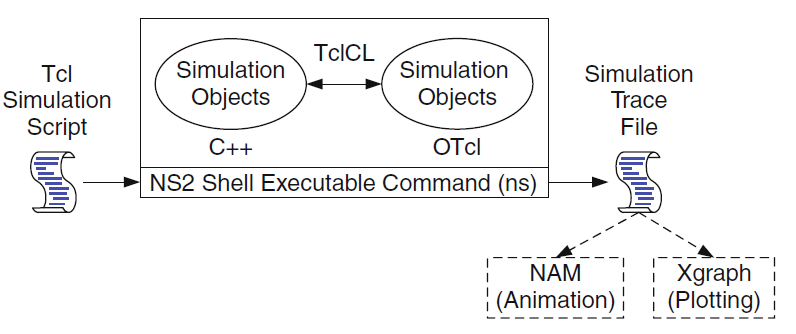
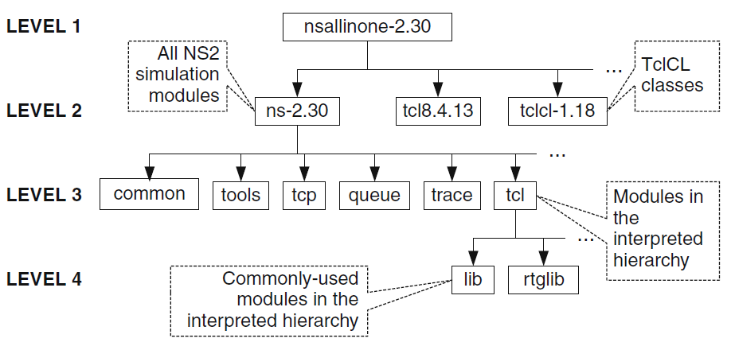

## Network Simulator NS2

> - Discrete event simulator, where the advance of time depends on timing of the events.
> - Used for simulation of wired as well as wireless network functions and protocols (e.g., routing algorithms, TCP, UDP).
> - NS2 consists of two key languages: C++ and Object-oriented Tool Command Language (OTcl).
> - While the C++ defines the internal mechanism (i.e., a backend) of the simulation objects, the OTcl sets up simulation by assembling and configuring the objects as well as scheduling discrete events (i.e., a frontend).
> - C++ is fast to run but slow to change. It is suitable for running a large simulation. 
> - OTcl is slow to run but fast to change. It is therefore suitable to run a small simulation over several repetitions.
> - Use OTcl
>   - for configuration, setup, or one time simulation, or
>   - to run simulation with existing NS2 modules.    
> - Use C++
>   - when you are dealing with a packet, or    
>   - when you need to modify existing NS2 modules.
> - "ns" is a C++ executable file obtained from the compilation,

**Basic Architecture of NS2**

  

  

**NS2 Directory**

  

## Topics

[ns2 Installation](ns2-Installation.md)

[ns2 Errors](ns2-Errors.md)

[ns2 Basics](ns2-Basics.md)

[Tcl Programming](https://github.com/brcnitk/TCL-Resources)

[OTcl Programming](https://github.com/brcnitk/OTCL-Resources)

[Program-1](Program-1) (3-nodes point-to-point topology)

[ns2 Scripts](ns2-Scripts.md)

[ns2 Traffics](ns2-Traffics.md)

[ns2 Trace](ns2-Trace.md)

[Program-2](Program-2) (4-nodes pint-to-point topology)

[Program-3](Program-3) (Dumb-bell ping)

[Program-4](Program-8) (Ring Topology)

[Program-5](Program-5) (1-Ethernet LAN 8-nodes)

[Program-6](Program-4) (Ethernet LAN 10-nodes)

[Program-7](Program-6) (Wireless)

