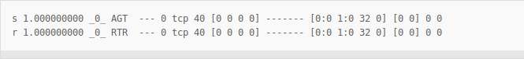
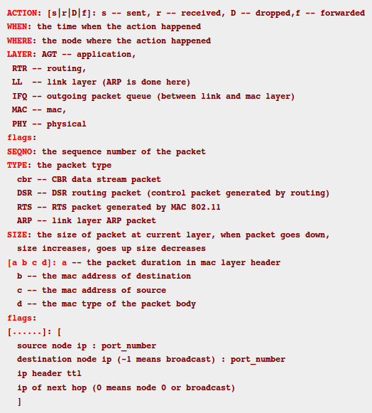

**Tracing**

**Trace File** (Wired network)

**Trace File** ([Wireless network - old format](http://nsnam.sourceforge.net/wiki/index.php/NS-2_Trace_Formats#Old_Wireless_Trace_Formats))

**Trace File** ([Wireless network - new format](http://nsnam.sourceforge.net/wiki/index.php/NS-2_Trace_Formats#Old_Wireless_Trace_Formats))

